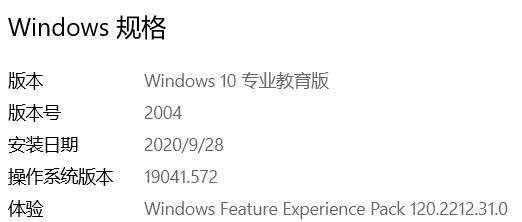
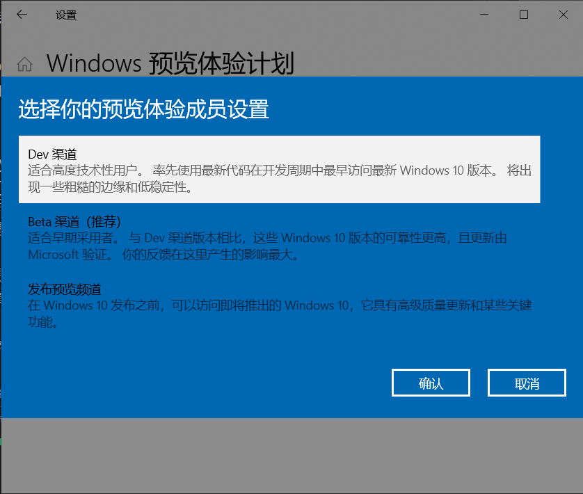
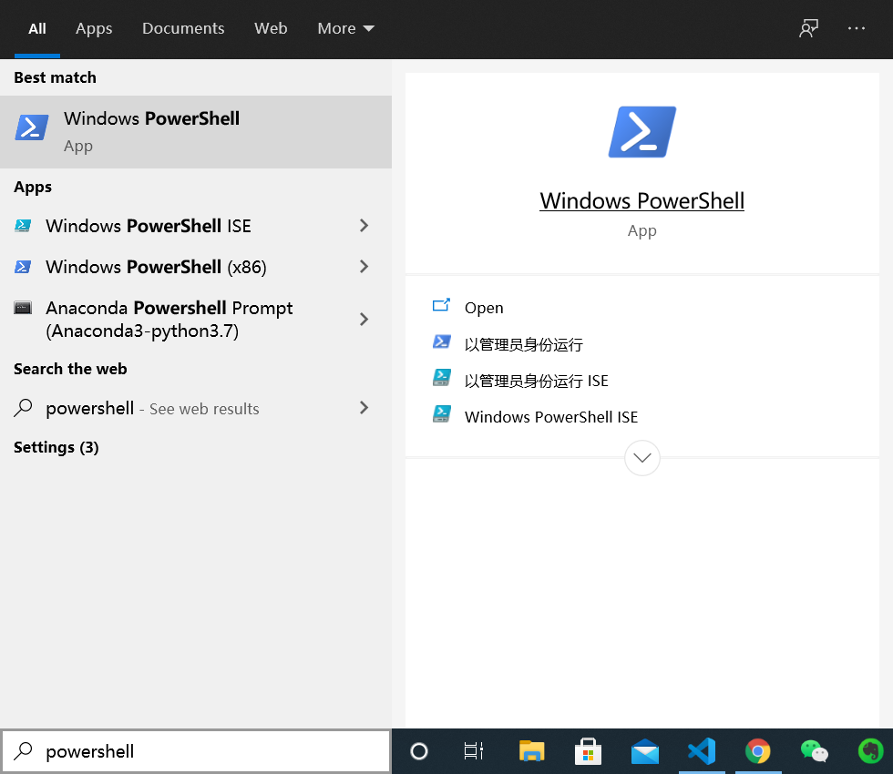
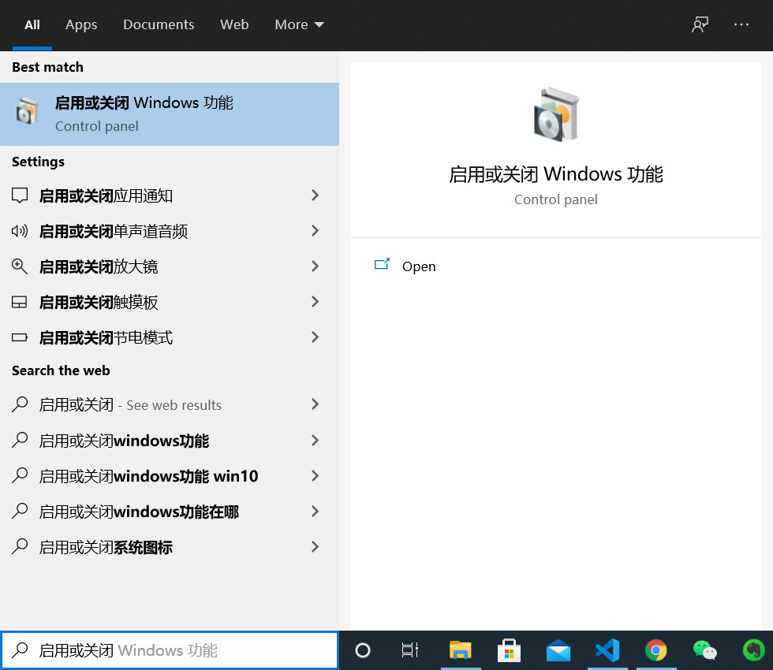
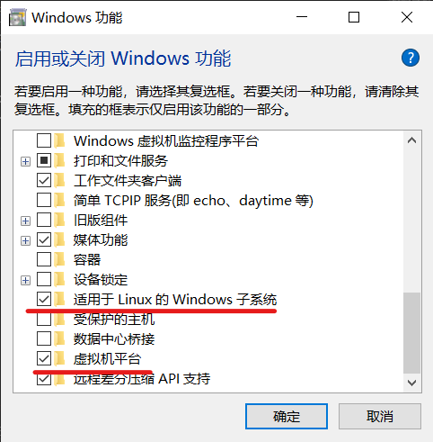
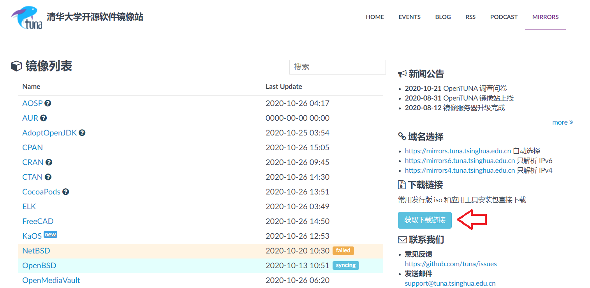
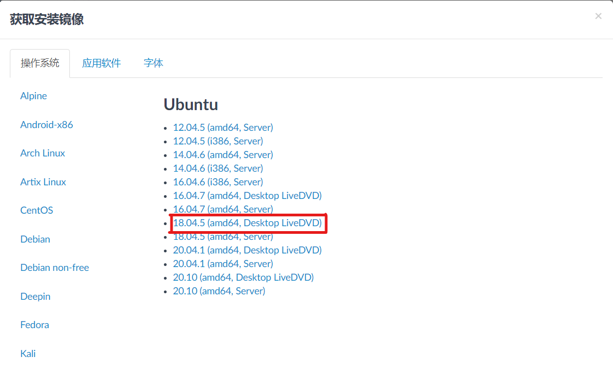
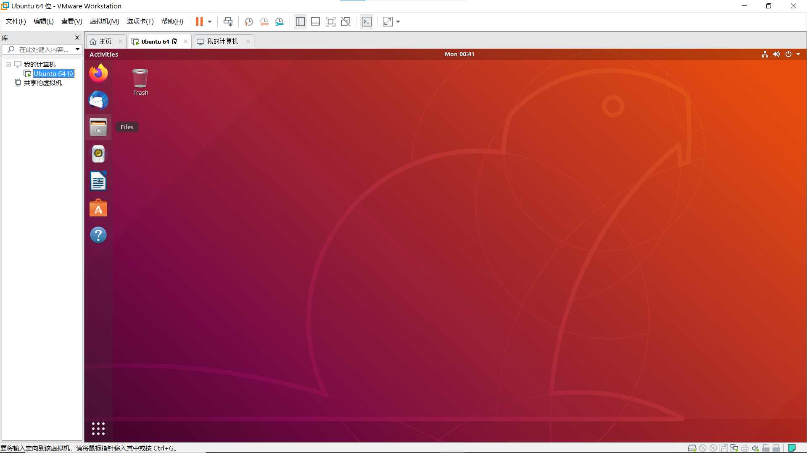
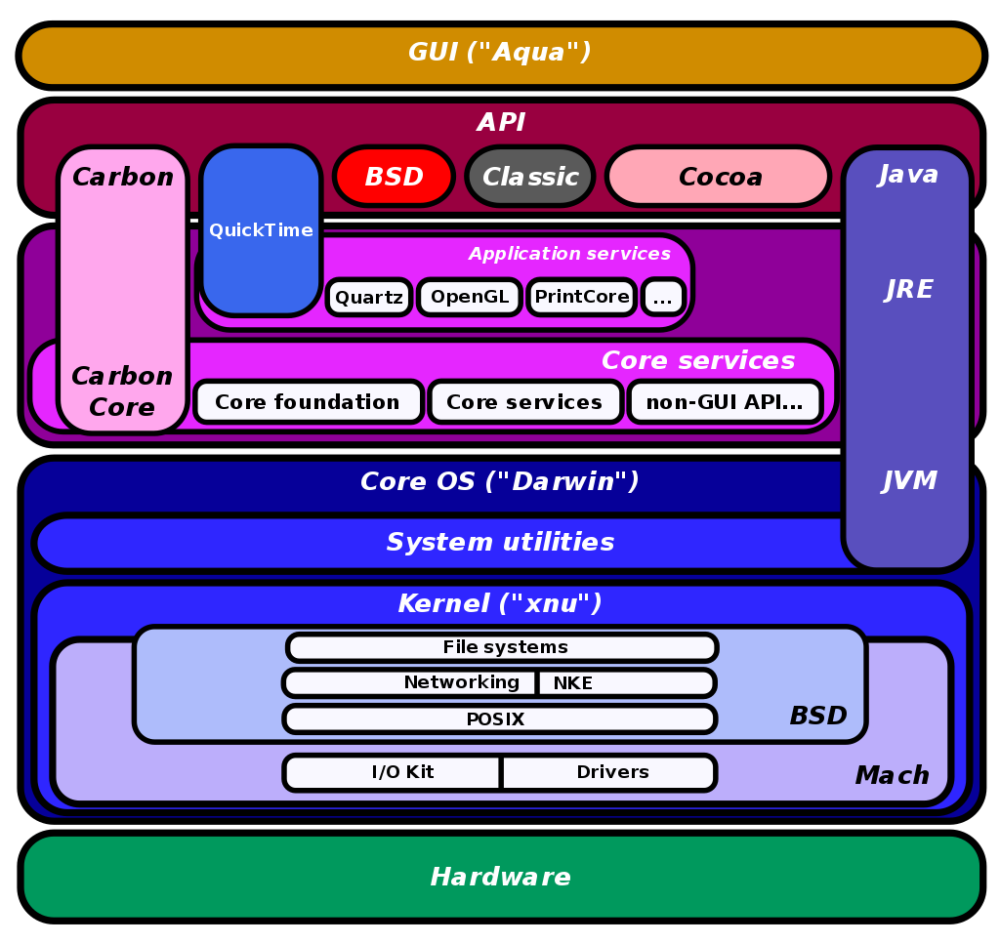

# Goodbye Windows

> 使用 macOS 或者 Linux 操作系统的同学请忽略这一章

如果你现在正在使用 Windows 操作系统，那么很抱歉的是我们可能要先和它说再见了。我们的实验会避免在 Windows 操作系统上进行，你需要跟着这个一章的内容安装某些软件来使用其他的操作系统。至于为什么要这么做，最重要的原因是这会让你之后的工作简单不少。

## 使用 WSL2

如果你使用的是 **Windows10** 操作系统，那么你可以使用 WSL（Windows Subsystem for Linux）来安装我们所需要的 Linux 操作系统环境。

简单来说，WSL 是在利用 Windows 模拟一个 Linux 的内核，可以运行 Linux 的可执行文件。但是这个 Linux 内核并不完整，有很多功能不能使用。我们要利用的 WSL 版本是 WSL2 ，这个 WSL 的实现是基于 Hyper-V 的，可以认为是一个微软自己优化过的模拟器，安装和使用起来都会稍微简单一点。

当然，如果因为任何原因无法成功安装 WSL2 ，那么可以选择使用安装[虚拟机](#使用虚拟机)来解决。

### 1. 确认 Windows 的内核版本

> 如果 Windows 的没有问题，那么可以直接安装 WSL2

为了安装 WSL2 ，你需要将 Windows 内核版本提升到一定程度。我们这里先默认使用的计算机都是 x86 架构的（不同的处理器架构可以在`设置 > 系统 > 关于`中查看，并且参考[微软官方文档](https://docs.microsoft.com/zh-cn/windows/wsl/install-win10)）

为了安装 WSL2 ，我们需要至少**内部版本 18362**的内核，内核的版本可以在`设置 > 系统 > 关于`中查看。



只要从图中的操作系统系统版本达到要求就可以。

如果操作系统的内核没有达到要求，有几种解决方案：

#### 安装更新

在 Windows10 的`设置 > 更新与安全 > Windows更新`中查看是否有可以安装的系统更新。

一般来说只要操作系统自身的功能正常，那么就可以正常地将 Windows10 升级到所需要的内核版本。

#### *加入 Windows 预览体验计划

如果发现 Windows10 的更新可以正常安装，但是还是不能达到所需要的内核版本，可以考虑加入 Windows 预览体验计划获得较新的更新。

在`设置 > 更新与安全 > Windows 预览体验计划`中点击“开始”后选择 Dev 渠道。这可以获得最新的版本更新，但是不一定很稳定，你可以在完成试验后将渠道切换成 Beta ，以获得更加稳定的版本。



之后重新进行 Windows 的更新即可

#### 恢复计算机

如果发现自己的操作系统无法正常地安装更新，可能说明操作系统有一定的损坏，可能需要选择“恢复”来保持个人文件的前提下恢复操作系统。

> **注：无论如何，在用任何方法重置系统之前都应该备份计算机中的重要数据**

进入`设置 > 更新与安全 > 恢复`选择“重置此电脑”并且“保留我的文件”

之后再次尝试是否可以正常更新操作系统

#### *重装操作系统

> **注：重装系统时有一定风险的。一定要备份计算机中的重要数据**

如果以上的操作都失败的话，可能是操作系统出了一些严重的问题，比如缺少了某个组件（比如我的操作系统就出了这样的问题）。那么最好的方法就是安装一个全新的操作系统。有几种可行的方法：

1. 使用微软官方提供的[mediacreationtool](https://www.microsoft.com/en-us/software-download/windows10/)制作一个安装介质，比如说安装到 U 盘中，然后利用 U 盘重新安装 Windows10。一般来讲，这会把你原来操作系统中的内容保留在系统盘中
2. 从别的地方（比如说从学校获得正版软件）下来对应的镜像或是软件来进行系统安装。一般来说，大学都会提供最新版本的教育版或专业版 Windows10 可供使用。

基本上重装系统后就可以获得所需要的操作系统版本了

### 2. 安装 WSL2

可以跟着[微软官方中文文档](https://docs.microsoft.com/zh-cn/windows/wsl/install-win10)进行配置，我们这里也会列出关键步骤

#### 2.1 启用功能

以管理员身份启动 powershell 运行一下两条指令

```powershell
dism.exe /online /enable-feature /featurename:Microsoft-Windows-Subsystem-Linux /all /norestart

dism.exe /online /enable-feature /featurename:VirtualMachinePlatform /all /norestart
```

比较简单的以管理员身份打开 powershell 的方法是从 Windows10 任务栏左下角的“搜索框”搜索 powershell 并且选择“以管理员身份运行”



除此之外，也可以通过在搜索栏中搜索“启用或关闭 Windows 功能”，通过可视化界面来选择：





勾选功能后重启计算机即可。

#### 2.2 下载 Linux 内核更新包

下载并运行更新包 [适用于 x64 计算机的 WSL2 Linux 内核更新包](https://wslstorestorage.blob.core.windows.net/wslblob/wsl_update_x64.msi)

#### 2.3 设定 WSL2 为默认版本

以管理员身份打开 powershell，运行下面的代码

```powershell
wsl --set-default-version 2
```

#### 2.4 从微软商店下载 Linux 的分发

接下来就可以安装一个 Linux 的分发版了。到微软商店（Microsoft Store）上搜索 Ubuntu ，下载并安装 [Ubuntu 18.04 LTS](https://www.microsoft.com/zh-cn/p/ubuntu-1804-lts/9n9tngvndl3q?rtc=1&activetab=pivot:overviewtab) 。(放心，这个分发版是免费的)

安装后在 powershell 中运行

```powershell
wsl --list --verbose
```

如果能看到`Ubuntu-18.04 Stopped 2`类似的说明则证明安装完成

p.s. 当你打开 WSL 时，你会发现它没有一个类似于桌面的显示，只有一个黑漆漆的命令行。我们和计算机的很多东西打交道的时候都是需要直接在命令行中处理的。我们之后会引入一些工具来辅助我们在 WSL 上进行编程。

## 使用虚拟机

虚拟机是一种软件，你可以认为这个软件利用软件的方法模拟了一台由硬件组成的计算机。虚拟机的种类很多，实现多样且细节复杂，这里不多展开。如果只是要使用的话还是非常简单的。

虚拟机有很多的选择，我们这里推荐安装 VMware ，因为其具有比较好的性能，但是因为需要激活，相关的激活步骤还请自行搜索。如果希望使用免费的虚拟机的话，VirtualBox 是个不错的选择，不过可能在性能上会逊色不少。

VMware 请自行寻找资源，VitualBox 的下载地址如下：

[https://www.virtualbox.org/wiki/Downloads](https://www.virtualbox.org/wiki/Downloads)

为了使用安装一台虚拟机，你首先需要虚拟机软件，然后是一个操作系统的镜像，就像你用 U 盘或是光盘安装电脑一样。

我们要安装的是 Ubuntu 18.04 LTS 版本，镜像的下载可以从[清华大学开源软件镜像站](https://mirrors.tuna.tsinghua.edu.cn/)下载。





### 配置虚拟机

在有了虚拟机软件和镜像后，配置虚拟机的过程就非常简单了。一般分为下面的几个步骤：

1. 打开虚拟机软件，选择“新建虚拟机”
2. 选择要安装的操作系统镜像
3. 选择要创建虚拟机的位置，硬件配置等

对于 Linux 的镜像，这两个虚拟机软件都有比较好的适配，安装起来较为简单，这里就不详细展开。

在创建好虚拟机后，就可以像是在一台新的电脑上进行操作一样使用新的操作系统了。



## 碎碎念

### Windows 碎碎念

Windows 是个非常好的操作系统，因为它简单易懂，并且提前安装到了绝大部分的个人电脑上，使得在大多数时候人们还是习惯使用 Windows 操作系统。但是这个道理在开发人员这里都不是很适用了，因为 Windows 为了使用简单，把很多的内容都给“藏了”起来，使得我们在操作系统上不能自由地行动。只要在 Windows 操作系统上进行过开发的人肯定能明白为了配置一个环境需要花多少时间，中途可能会遇到各种奇怪的问题。于是我们为了规避这些问题（同时也为了读者对计算机有更加深入的理解），我们只能先放弃非常熟悉的 Windows ，而去探索使用其他的操作系统了。

### macOS 碎碎念

Mac 也是个非常好的操作系统（笑）。相信绝大多数人都是先接触的Windows，然后才换的 Mac，因此会感到比较大的不适应：Mac的各种操作和UI和Windows有着较大的不同，许多基本概念也不同（我的电脑，文件系统，程序等）；更主要的是，原本熟悉的软件一个个的都不能用了，exe无法运行，AppStore要么垃圾要么付费。因此有很多人用了一小段时间后，就去装windows双系统了（其实是完全放弃了Mac）。而一旦撑过了最开始的适应期，上手之后就会被感受到Mac的优势了：界面好看整洁，社区相对干净，软件相对不那么流氓。

对于开发人员而言，Mac的优势在于环境安装的友好，其操作系统与Linux非常相似，很多命令也是通用的。macOS 包含两个主要的部分：操作系统的 Darwin 和图形界面的 Aqua。Darwin也是类UNIX家族中的一员，可以跟Centos，Ubuntu这些都算是远亲了。从血统上来说，Darwin才是真正的UNIX传人。macOS的架构图如下：



从图中可以看出，macOS对外的操作系统API有很多都是遵守BSD规范的，所以写给Linux的软件往往也比较容易移植到macOS上。不过毕竟还是有很多不一样的地方，所以写代码可以在mac上（因为显示好看，尤其是字体），但是运行最好还是都在Linux虚拟机上。


