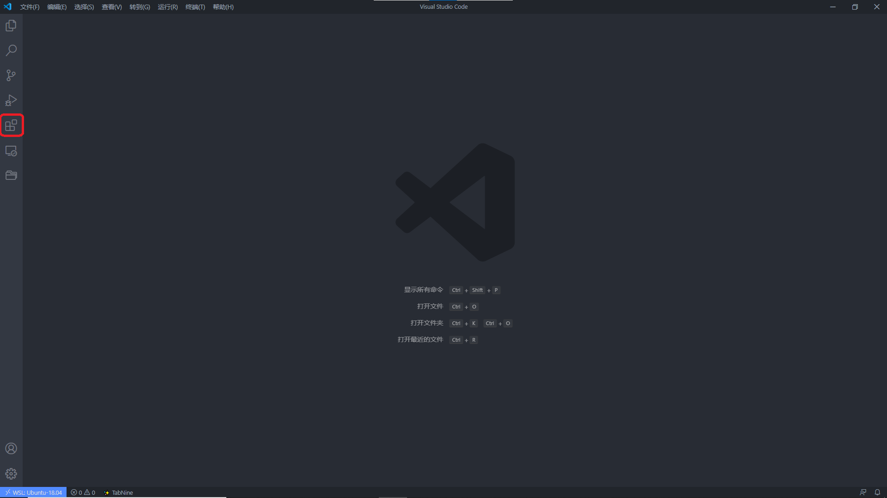
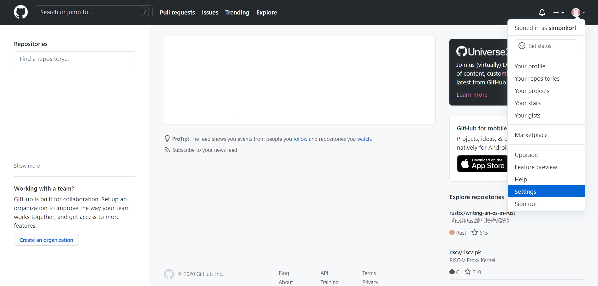
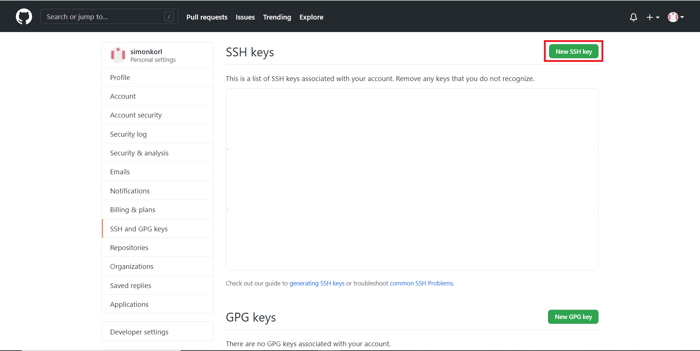
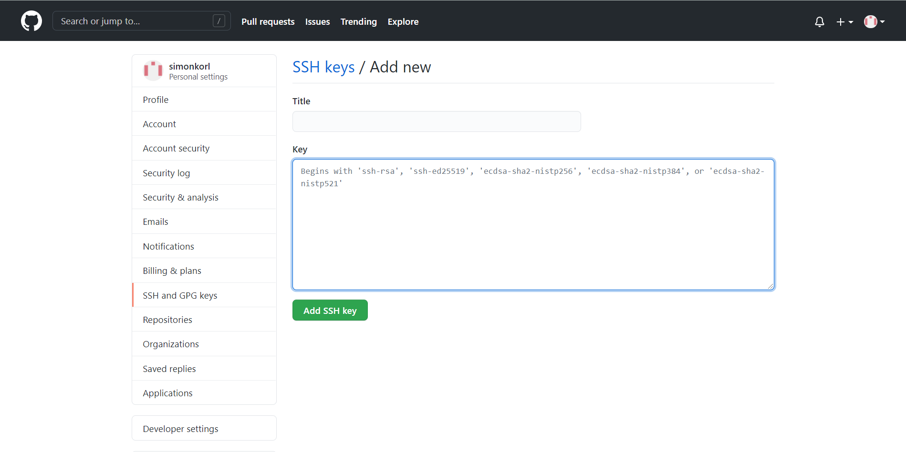
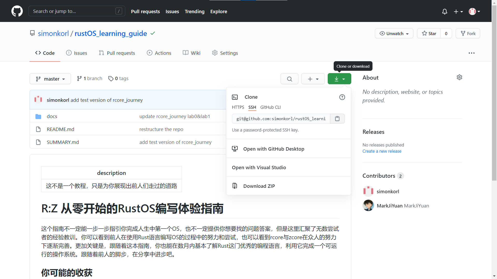
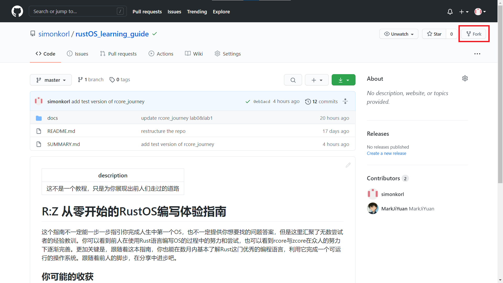
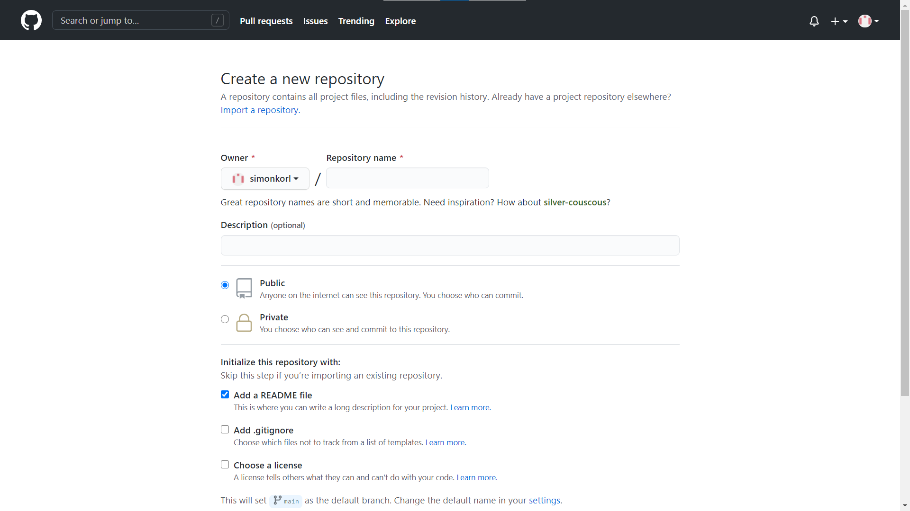
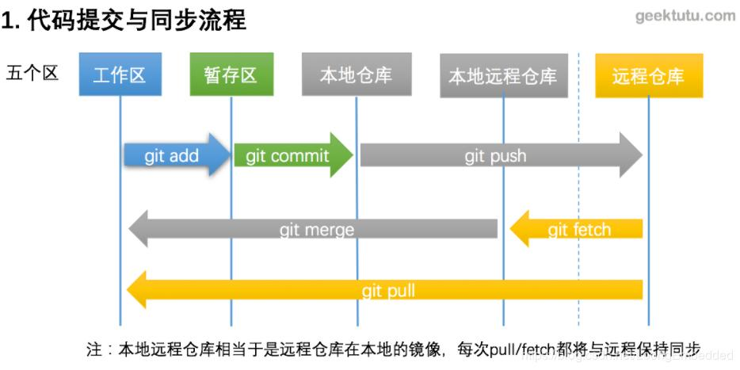

# 编程工具

古话说的好：“工欲善其事必先利其器”。虽然对于计算机大神来说，估计哪怕就给他们一根笔和一块生板子，他们也能拿笔在纸带上打上洞，塞到板子里跑起程序来（指的是纸带计算机）。我们不用对自己有那么高的要求，能够快速上手编写正确的程序就是我们的目标，这个时候，一个简单好用的编程工具就是我们首先要考虑的问题。

## 编辑器

如果你以前接触过计算机编程，那么你很有可能接触过 IDE ，即“集成开发环境”，比如说 Dev C++, Eclipse, Visual Studio 等等。这些工具大多帮你集成了很多的内容，使得你只需要专注于写代码，然后按一个什么按钮就可以让整个项目编译运行起来了。

不过我们要在这里推荐的并不是 IDE ，而是编辑器。说得简单一点，就是一个高级的“记事本”，你能在里面写字就已经足够了。如果它还能为你提供更多的功能那就更好了。至于为什么我们没有推荐使用 IDE ，下面是一些理由：

1. **太臃肿**: IDE 大多因为集成了很多内容而显得非常臃肿。如果你用过 Vistual Studio 就知道为了下载安装一个 Visual Studio 需要花多少时间。我们现在希望能够赶快深入到计算机内部，完全不需要带那么多额外装备，一个有提示的文本编辑器就已经非常足够了
2. **太高级**: IDE 对于程序的运行进行了较多的封装。还以 Visual Studio 作为例子，如果不进行深入的了解，你可能连自己写的程序究竟是怎么编译和运行的都不知道，更不用说了解库与链接的相关内容了。我们学习操作系统必须要回归到最为基本的程序——汇编代码，我们会无法避免地和汇编代码打交道，直接和计算机的架构进行交流。在这个基础上，我们就需要
3. **还没有**：额，这可能才是最为核心的问题。目前大多数的 IDE 对于 Rust 的支持还没有那么好，目前来说对于 Rust 的语言支持大多数来自插件。你就会发现实际上许多编辑器靠着插件对 Rust 的支持就已经很优秀了，完全没有使用 IDE 的必要。可以查看[Are we (I)DE yet](https://areweideyet.com/)网站查看各个编辑器与 IDE 对 Rust 的支持情况

### Windows

在 Windows 操作系统下，我们强烈推荐使用 VS Code。理由如下：

1. **简而易懂**：VS Code 全名为 Visual Studio Code ，人如其名，这个编辑器是微软公司开发的免费开源的代码编辑工具。和 Visual Studio 不一样，VS Code 直接支持 Windows, Linux 和 macOS 三个最为常见的操作系统，在多个平台上都有支持。而且用户界面比较友好，适合新人。各类插件也很丰富，安装简单。作为上手难度较低的编辑器，VS Code 应该是一个快速上手编程的不二选择。
2. **与 WSL 完美契合**：毕竟都是微软家自己的东西，VS Code 可以很简单地做到连接 WSL ，使得在本没有图形界面的 WSL 上进行编程简单了很多
3. **对 Rust 的支持较好**：在众多的编辑器当中 VS Code 利用插件便可以做到对 Rust 的各方面支持，包括语法高亮、自动补全、代码跳转、调试等实用功能。与此同时，VS Code 也没有集成过多的内容，除了在编辑代码上有所帮助外，对于有关编译的事情并没有过多插手，使得我们还可以自己掌握对于程序的编译与运行。

既然优点很多，那么为什么不使用呢？VS Code 可以在[官网](https://code.visualstudio.com/)上进行下载

#### 插件

下载并安装后，我们需要安装一些插件来让我们对于一些文件类型的编辑更加得心应手。插件的安装位于屏幕最左侧的工具栏中。



只需要在搜索栏中搜索并安装插件即可

我们推荐安装的插件列表如下：

1. 中文支持：`Chinese (Simplified) Language Pack for Visual Studio Code`（简体中文）, `Chinese (Traditional) Language Pack for Visual Studio Code`（繁体中文）
2. Rust：`Rust` , `Rust Extension Pack`
3. Markdown：`Markdown All in one`,`Markdown Extended`, `Markdown Preview Enhanced`, `markdownlint`
4. RISC-V ASM（汇编代码）：`RISC-V Support`
5. 额外推荐：
   1. Git 工具：`git graph`
   2. 自动补全工具：`TabNine`

### macOS

未完待续。。。
<!-- 请增加对于 macOS 推荐的编辑器 -->

### Linux

我们默认现在就已经在使用 Linux 的同学肯定已经有自己比较适合的编辑器了，接下来你需要做的事情就是为它装上对应的 Rust 插件。可以参考[Are we (I)DE yet](https://areweideyet.com/)上的说明。

## Git

> “这个念 geet，不念 dgit”

只要你深入学习了计算机一段时间，你应该对这个词汇感到很熟悉。就算你对 Git 这个词不是非常熟悉，那么你至少会对 GitHub 这个词感到非常熟悉，在这个网站上你可以找到很多的开源代码项目；也有人把这个地方作为某种文件仓库，各种各样的文件上传上去，形成一个公共仓库，供其他人查阅。在我们所进行的 Rust 语言学习与 rCore 实验中是离不开 Git 这个工具的。我们在这里简单说明一下这个工具的使用方法。

### Git 简介

Git 究竟是个什么东西呢？如果你到 wiki 上搜索一下，它会告诉你这是一个“分布式版本管理工具”，基本上相当于是使用听不懂的词汇翻译听不懂的词汇。简单来说，它可以帮你跟踪保存文件的各个版本的状态，还可以帮助多个协作者共同维护同一个项目而不会互相干扰。对于我们来说，它至少可以用来：

1. 保存你的代码：你可以把你的代码上传到 Github 上来进行保存。这样你之后无论遇到什么事情都还可以把你的代码重新下载回来。
2. 下载学习资料：我们的文档以及你要进行实验的仓库均在 Github 上进行储存，你需要从 Github 上进行下载。
3. 交流你的学习成果：Github 除了代码的储存还提供了一些可以用于交流的平台（就像是论坛一样），你可以在那里提出你对这个文档的建议，或是为这个文档做出贡献，提交你的修改成为 pull request ，来使你自己也成为文档的编辑者之一。

你也许需要在未来花一些额外的时间来学习 Github 各个部分的使用方法。我们现在只会对给你提供一些 Git 的最基础的使用指导，防止你在到处乱撞的时候浪费太多时间。

### Git 的使用简介

好消息是，如果我们使用的是 Linux 操作系统，大多数分发版都已经安装了 Git。我们只需要直接在命令行中使用指令就可以了。这里就不额外进行 Git 安装的相关介绍了，需要安装 Git 工具的同学请直接在[Git 官网](https://git-scm.com/downloads)上查询对应操作系统的安装方法。

#### ssh 连接 Github

这里我们可能又要提出一个新词叫 ssh ，你可以认为你可以用这个工具和任何一个网络上的终端建立一个安全连接，不过需要提供你的密钥。我们现在需要在 Github 上添加一个你的 ssh 密钥，这样的话你就可以非常方便地在 Github 上上传和下载代码了。

##### 生成公私钥对

首先你需要生成一对公私密钥对，这相当于你的 ssh 密码。在命令行中输入下面的指令

```sh
ssh-keygen -t rsa -b 4096 -C "your_email@example.com" #最后输入自己的邮箱或是别的作为备注
```

之后你应该可以收到类似的信息：

```sh
> Generating public/private rsa key pair.
# 你可以修改储存私钥的路径
# 请注意你需要输入一个完整的路径，而不是相对本目录的路径
> Enter a file in which to save the key (/home/you/.ssh/id_rsa):[Press enter]
# 你可以输入一个密码来管理你的私钥，不过并不必须
> Enter passphrase (empty for no passphrase): [Type a passphrase]
> Enter same passphrase again: [Type passphrase again]
```

在完成上面的操作后，你可以在保存的目录中找到自己的公私钥对。比如说你储存的文件名为`id_rsa`那么你会得到：`id_rsa`,`id_rsa.pub`两个文件，其中具有 .pub 结尾的文件是你的公钥，可以给别人看；那个没有后缀的是你的私钥，不能给别人看到。

之后你需要把你的公私钥对加入到你本机的 ssh 工具中去。运行下面的指令

```sh
eval "$(ssh-agent -s)"
ssh-add ~/.ssh/id_rsa
```

这样就可以把你的公私钥对增加到本机的 ssh 工具中。

##### 把公钥添加到 Github 上

接下来你需要在 Github 上添加你的公钥。你可以使用浏览器完成这个步骤

在登录 Github 后点击头像进入 Settings



选择左侧的 SSH and GPG keys，之后点击右上角的 New SSH key



将之前生成的 .pub 密钥文件中的内容粘贴到标题为 Key 的文本框中就可以了。你可以在 Title 中给它标注一个名称



最后点击下方的按钮进行确认就可以了

##### 测试配置

你可以利用 ssh 工具向 Github 发一个测试请求来确认一下配置没有错误

```sh
ssh -T git@github.com
```

如果可以收到类似下面的信息则说明配置正确

```sh
> Hi yourname! You've successfully authenticated, but GitHub does not provide shell access.
```

如果过程中遇到了问题，请参考 Github 的官方引导 [generating a new ssh key](https://docs.github.com/en/free-pro-team@latest/github/authenticating-to-github/generating-a-new-ssh-key-and-adding-it-to-the-ssh-agent#)

另注：如果你原来配置过 Github 的密钥，或者你在本机上要用不同的密钥连接多个不同的终端，你也许需要配置 ssh config 文件。关于该文件的配置请自行在网络上搜索。

<!-- 我不确定 mac 上是不是也差不多是这么做，请确认一下 -->

#### 从 Github 上 clone 仓库

现在我们已经配置好了 ssh 密钥了，已经可以准备去下载代码了。

在 Git 中，clone 代表我们申请去获得一个仓库的所有代码的一个拷贝。此时你就获得了一整个仓库的代码，但是并不能进行提交（因为你可能没有这个仓库的代码开发权限）。不过你可以通过 fork 来获得一个属于你的该仓库的拷贝，然后可以把你的修改保存在 Github 上面。

所谓 fork ，你可以认为是你从一个仓库中分出一条枝子，成为你自己开发的分支。你可以获得这个仓库的此时的版本，并且可以自由地编辑和上传你的修改而不会改变源代码的仓库。如果你希望把自己的修改提交到源代码仓库中则需要发布 pull request ，这是什么我们之后再说。

要 clone 一个仓库实在是太简单了：首先到 Github 上找一个看着顺眼的仓库，它的仓库中有一个绿色的下载按钮。



选择 ssh ，复制内容后在命令行中输入

```sh
git clone git@github.com/...
```

我们这里可以先克隆我们的文档仓库作为测试：

```sh
git clone git@github.com:simonkorl/rustOS_learning_guide.git
```

之后你就会看到自己的当前目录下增加了一个新的目录，名称和 clone 的仓库相一致。此时你已经获得了该仓库的一个复制。

如果希望自己能够上传和保存自己的代码，可以先将仓库 fork 到自己的账号下。通过点击仓库上的 fork 按钮。



之后重新进行 clone 操作即可。

#### 新建仓库与编辑

我们现在新建一个仓库，作为我们学习记录的保存仓库。

为了完成这件事，我们需要分别在本地和 Github 建立我们的代码仓库，然后将两者进行同步。

为了在本地建立仓库，我们可以在任意一个目录下使用`git init`命令初始化一个仓库

我们不妨在用户目录下新建一个目录作为测试仓库

Linux

```sh
cd ~ # 回到用户的根目录
mkdir rCore_learning # 新建目录
cd rCore_learning # 进入目录

git init # 初始化 git 仓库
```

为了获得一个远程的仓库，你可以在 Github 上，通过右上角的 + 图标选择 New repository



你可以选择这个仓库是公开的 public 还是私有的 private。我们推荐你将这个仓库公开，这样你就可以分享你的学习过程，也许可以帮助到其他的同学。

你可以选择添加一个新的 README 文件，这是一个仓库的描述文件，它会默认生成一个放在你的远程仓库中。

这时你就可以获得一个和 Github 上样子完全相同的仓库界面。同样是选择它的 ssh 部分的地址，在你的本地仓库中使用

```sh
git remote add origin git@github.com/...
```

这句话的含义是为本地仓库添加一个远程的同步仓库，并且将其命名为 origin。

#### 代码提交与同步



现在我们有了本地仓库和远程仓库，但是两边的内容并不相同。我们需要首先获得远程仓库内容。这里可以运行`git fetch`来获取远端仓库的信息或者执行`git pull`直接将远程仓库的内容合并到本地仓库。如果可以合并则 Git 会直接合并，否则它会请求你手动合并文件内容之后进行提交。

我们本地仓库的文件有三个状态：

1. 未跟踪（untracked）：这类文件没有被 Git 保存，也不会进行上传。使用`git add filename`的方法添加文件或者添加目录，如`git add .`可以直接添加所有的文件。
2. 已修改（modified）：已经添加过的文件如果进行了修改，则会进入到已修改 modified 的状态。需要使用`git add`指令来说明哪些文件需要保存已经修改的状态
3. 暂存（staged）：被`git add`指令添加的文件处于暂存区，状态为 staged 。这些文件的修改已经暂存在本地，可以使用`git commit`进行提交（在本地）

我们不妨在目录下的`README.md`文件中稍微进行修改一下：

```markdown
# rCore_learning

这个仓库记录了学习 Rust 与 rCore 的过程
```

之后便可以使用

```sh
git add README.md
git commit -m "修改了 README.md"
```

进行提交。注意`git commit`后面的参数代表提交的描述。如果不直接添加的话系统会默认打开命令行使用 GNU nano 编辑器进行提交文本的编辑。这个编辑器的键的绑定方法也比较奇怪，不过可以用方向键移动光标，并且直接输入文字。使用 Ctrl + X 进行退出并且选择是否保存（y/n），之后使用回车即可退出。

在提交后，本地的修改可以认为已经进行了保存：你提交了一个修改记录，记录了与上一次记录相比仓库中的文件有了什么修改。不过这些修改还留在本地，如果要将修改保存到远端仓库需要执行`git push`操作，说明利用本地的仓库更新远端仓库。

```sh
git push -u origin master
```

我们第一次提交的时候可以使用`git push -u origin master`的方法指定我们本地的分支与远端分支的关系。至于分支的具体使用方法还请自行进行查询和学习。在之后的 push 操作中只需要使用`git push`即可。

注：如果本地与远端仓库不同步，则 Git 会提醒你先执行 pull 后执行 push ，这是为了防止远端的仓库代码被破坏。虽然可以使用本地代码强行替换远端仓库，但是强烈不推荐这么做，除非必要情况，否则一定要确认一下远程仓库的变化。

到此，我们就结束了 Git 的基本使用介绍。有一些编辑器会提供给你图形化的界面来操作 Git，你可以借助这些工具更快捷地使用 Git。在之后的学习过程中，你可以将学习的过程整理为文档保存在你的代码仓库中和他人进行共享。

## 碎碎念

### Linux 和编辑器

在编者刚刚接触 Linux 的时候，在配置系统的时候无法避免地要打开文件并且进行编辑。系统默认使用的编辑器是 vim ，结果一上来就遇到了两个很严重的问题：

1. 这个东西我怎么编辑啊？
2. 这个东西怎么关上啊？

尤其是第二个问题，应该可以记录在《程序员语录》当中了，据说还有一个 stackoverflow 的帖子专门讨论如何关闭 vim 。

vim 是现在常见的 Linux 分发中的内置文本编辑器。编者当时费了半天劲，在键盘上瞎按了一通才成功地让游标编程熟悉的竖线的样子而不是一个块。结果好不容易编辑完，Ctrl + s 也不好用，退出的话 ESC 键也没有用，只有在敲 Ctrl + C 想要强制退出的时候才会有提示

```sh
Type  :qa!  and press <Enter> to abandon all changes and exit Vim
```

结果折腾了好半天才把文件编辑保存了。

刚开始计算机的时候使用的是 Windows 操作系统的话，一上来给出这样一个以命令为主，且一个按钮都没有的编辑器确实让人非常头疼。vim 拥有一些特殊的概念，比如说模式（mode），可能一上手会让人摸不着头脑。像这样的编辑器应该都属于元老级别，学习曲线可能非常陡峭且“怪异”，通常只有高级计算机工程师才能熟练掌握并且发挥其最大的作用。作为新手的话我还是觉得先从简单的编辑器开始：咱们用编辑器是为了方便写程序，而不是用来耍帅的。要是有什么人向你安利 vim，emacs 一类的编辑器，大可夸对方两句“大神”然后回绝掉。
